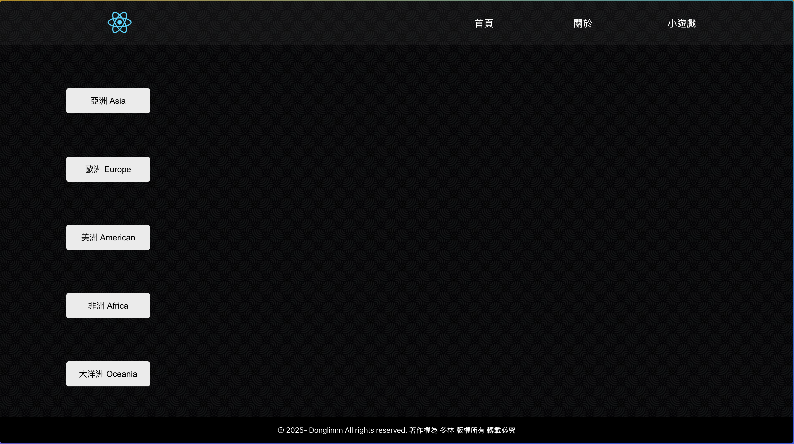
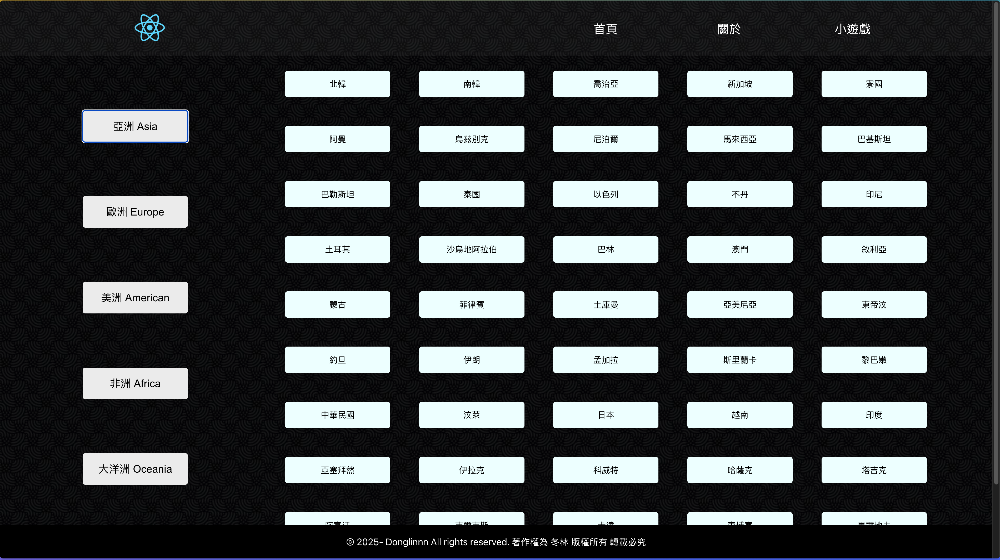
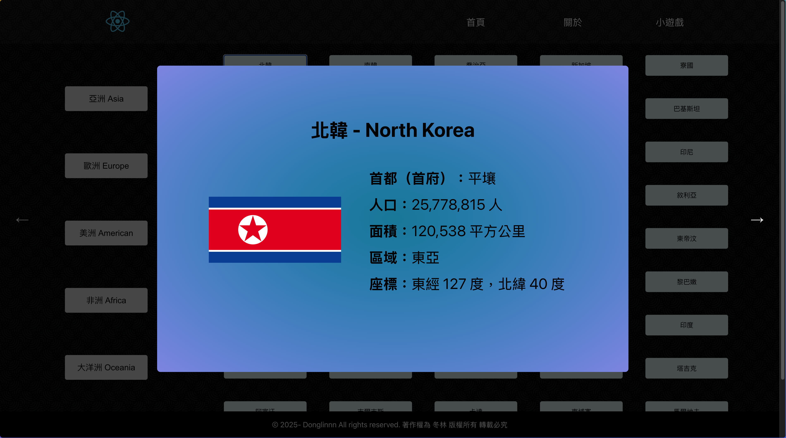
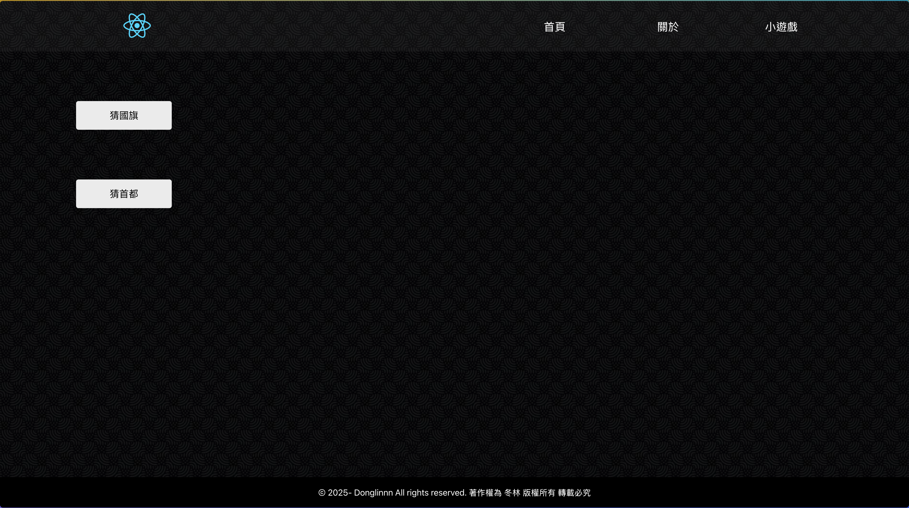
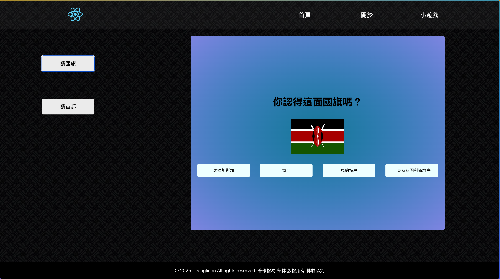
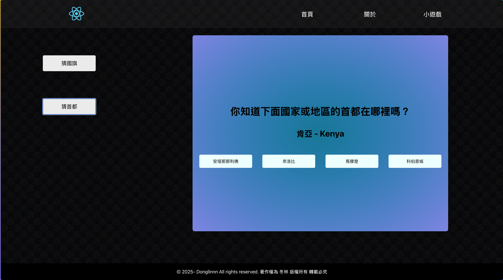

# 國家資訊網專案

### 這是一個可供使用者查看各大洲國家或領地的基本資訊的網站，另外安排了兩個小遊戲可供使用者互動。

### 透過抓取 RestCountries API 來獲取國家的基本資訊，因其沒有提供繁體中文的資料，我另外寫了一個 json 對照表翻譯成繁體中文。

#### 首頁畫面：首頁上方可供使用者選擇欲查看的大洲，點擊後即可抓取相應的 API ，以按鍵列表形式列出所有國家，點擊其中一個國家，即可展開該國家的資訊卡，包含國旗、首都、人口、面積及所在位置等等資訊，也可點擊頁面左右的箭頭查看上/下一個國家的資訊卡。

#### 小遊戲頁面：與首頁佈局類似，點開小遊戲的按鍵即可開始遊玩。

#### 猜國旗遊戲：點擊猜國旗按鈕即可遊玩，會出現四個選項供使用者選擇，會根據使用者選擇的答案正確與否出現相應的提示字。

#### 猜首都遊戲：點擊猜首都按鈕即可遊玩，會出現四個選項供使用者選擇，會根據使用者選擇的答案正確與否出現相應的提示字。

